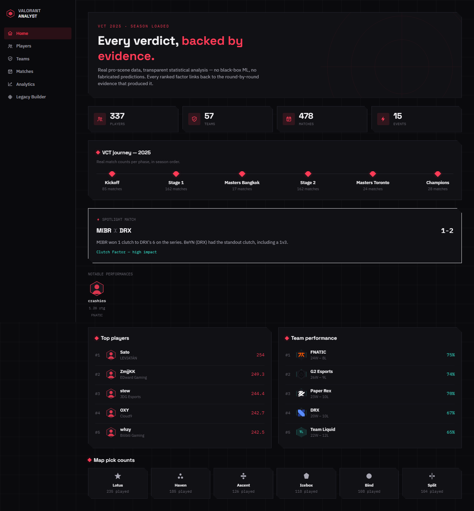
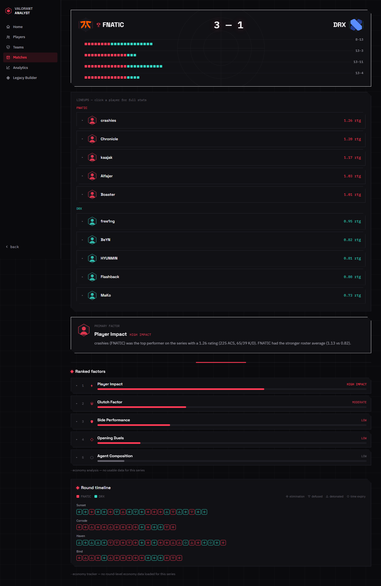
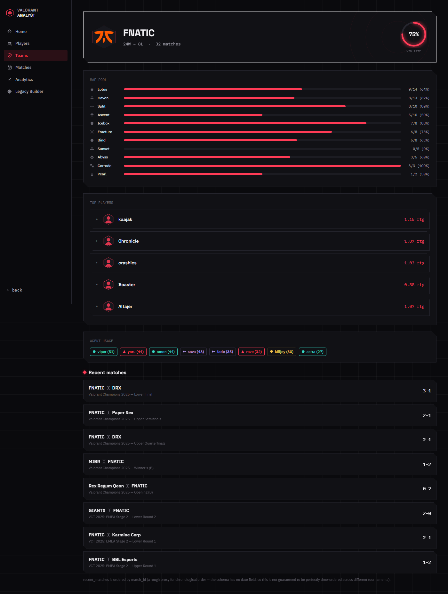
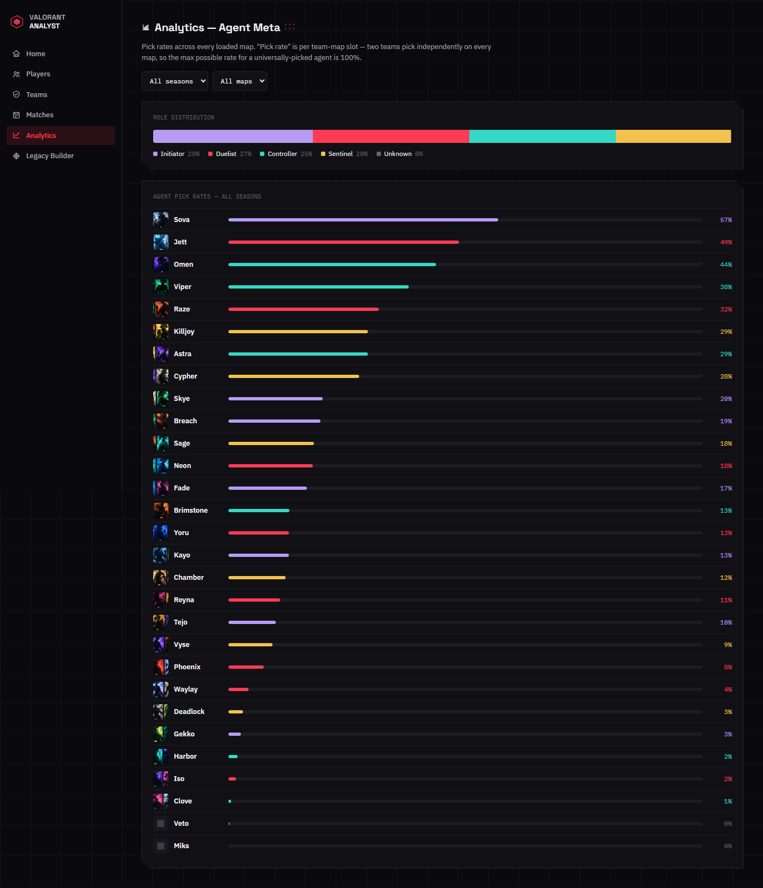

# Valorant Analyst


An open-source VALORANT esports analytics platform built on **real pro-scene
data**, with **transparent, inspectable statistics** — no black-box ML, no
fabricated predictions. Every number on screen traces back to a real loaded
match, or the feature says so explicitly and shows nothing rather than guess.

Built around one philosophy: **Data → Analysis → Explanation → Recommendation.**

Loaded against the full 2021–2026 VALORANT Champions Tour history — 12,621
matches, 15,215 players, 4,017 teams, across 249 tournaments — from the
[Ryan Luong VCT dataset](https://www.kaggle.com/datasets/ryanluong1/valorant-champion-tour-2021-2023-data)
on Kaggle (MIT licensed).

## Screenshots

<table>
<tr>
<td></td>
<td></td>
</tr>
<tr>
<td align="center"><sub>Home dashboard — map art, leaderboards</sub></td>
<td align="center"><sub>Match verdict — ranked, evidence-backed factors</sub></td>
</tr>
<tr>
<td></td>
<td></td>
</tr>
<tr>
<td align="center"><sub>Team profile — record, map pool, roster, agent usage</sub></td>
<td align="center"><sub>Analytics — agent pick rates, filterable by season/map</sub></td>
</tr>
</table>

## What it does

- **Match Analyzer** — "why did this team win?" Six independent statistical
  analyzers (opening duels, side performance, player impact, economy, agent
  composition, clutch factor) each rank themselves by measured impact and
  combine into one ranked, evidence-backed verdict.
- **Team Analyzer** — every team with loaded match data, searchable and
  ranked strongest-first by all-time win rate, filterable by professional
  tier (Tier 1 international/franchised orgs vs. everyone else — also
  what keeps the browse view fast with 4,000+ teams loaded); each team's
  full-season profile (record, map pool with map art — click a map for
  that team's most kills/assists/effective player on it — roster
  filterable by year, agent usage, recent matches, and a 5-axis stat
  profile chart comparable against any other Tier-1 team).
- **Players leaderboard** — top 20, ranked by Rating, ACS, ADR, KAST%, or
  HS%, across every loaded season, each with their historically
  best-performing agent shown as a profile photo. Pick any two players to
  overlay their 5-axis stat profile.
- **Matches** — browse and search by team, tournament, or year (2021–2026).
- **Legacy Roster Builder** — build two hypothetical 5-player lineups and get
  a transparent model projection of the matchup. Always labeled a
  projection, never a factual claim, and explicit about what it can't
  measure (lineup synergy, and that individual ratings are blended across
  every loaded season rather than one year's form).
- **Analytics** — agent pick rates and role distribution, filterable by
  season and map, with agent art.
- **Home dashboard** — league-wide stats, season journey, leaderboards, map
  pick counts with map art.

## Stack

| | |
|---|---|
| **Backend** | Python, FastAPI, SQLite, pandas (ETL) |
| **Frontend** | React, Vite, Tailwind CSS ([`frontend/web/`](frontend/web)) |
| **Legacy frontend** | Dependency-free single-file HTML/CSS/JS, kept for reference/no-build-step use ([`frontend/prototype/`](frontend/prototype)) |

## Project structure

```
valorant-analyst/
├── backend/
│   ├── app/
│   │   ├── analyzers/        12 analyzer modules — the analytical core
│   │   ├── database/         schema.sql
│   │   └── main.py           FastAPI app, 13 endpoints
│   └── data/
│       ├── raw/               (gitignored — see backend/data/README.md)
│       ├── dataset_report.md
│       ├── DATA_QUALITY_FINDINGS.md
│       └── valorant.db        (gitignored — ~180MB, build it locally, see below)
├── frontend/
│   ├── web/                   React + Vite + Tailwind app (active UI)
│   └── prototype/
│       └── index.html         original no-build-step prototype (legacy)
├── docs/
│   └── screenshots/
└── scripts/
    ├── inspect_dataset.py
    └── load_match_analyzer.py
```

## Quickstart

**1. Get the data.** `backend/data/valorant.db` isn't in this repo — it's
~180MB (GitHub hard-blocks any push over 100MB), so it's gitignored and
built locally instead:

```bash
# Download https://www.kaggle.com/datasets/ryanluong1/valorant-champion-tour-2021-2023-data
# and extract it to backend/data/raw/, then:
pip install pandas
for year in vct_2021 vct_2022 vct_2023 vct_2024 vct_2025 vct_2026; do
  python scripts/load_match_analyzer.py backend/data/raw "$year" \
    --out backend/data/valorant.db \
    --schema backend/app/database/match_analyzer_schema.sql
done
```

Run the loader once per year, pointing `--out` at the same file each time —
it accumulates rather than overwrites. (To rebuild a single season from
scratch instead, overwriting whatever's already at `--out`, add `--fresh`.)
This takes a few minutes — 2021 and 2022 alone are ~7,200 and ~3,800 matches.

See [`backend/data/DATA_QUALITY_FINDINGS.md`](backend/data/DATA_QUALITY_FINDINGS.md)
for the real data-quality issues found and handled while building this ETL —
genuinely worth reading before extending it.

**2. Run the backend and frontend:**

```bash
# Backend — FastAPI + SQLite
cd backend
pip install fastapi "uvicorn[standard]" pandas
python -m uvicorn app.main:app --reload
# -> http://127.0.0.1:8000  (interactive API docs at /docs)

# Frontend — React + Vite
cd frontend/web
npm install
npm run dev
# -> http://localhost:5173, auto-connects to the API above
```

No backend running (or hadn't built the database yet)? The frontend falls
back to a small set of real (not fabricated) bundled demo data
automatically, so it's still browsable. See
[`frontend/web/README.md`](frontend/web/README.md) for build/env-var
details, or open [`frontend/prototype/index.html`](frontend/prototype/index.html)
directly in a browser for the zero-install legacy version.

## Design principles

- **Never fabricate a statistic or hallucinate a tactical explanation** —
  every number traces back to real loaded data, or the feature says so
  explicitly and shows nothing rather than guess.
- **No black-box ML for "why did X happen"** — transparent, inspectable,
  component-based scoring throughout.
- **Sample size matters** — small-sample results are flagged, not treated
  equally with well-supported ones.
- **Hypothetical/projected content** (the Roster Builder) is always labeled
  as such, never presented as a factual prediction.

## License

MIT — see [`LICENSE`](LICENSE) (matches the source dataset's license) for
the code in this repository. This project deliberately avoids reproducing
Riot's own game assets: player portraits show a player's historically
best-performing agent as original stylized art (falling back to an
abstract SVG silhouette), not a real photo of the player, and the
agent/map artwork under `assets/agents/` and `assets/maps/` is original
AI-generated illustration in an independent art style — not real
screenshots, in-game callouts, or Riot character art. See
[`frontend/web/README.md`](frontend/web/README.md) for details. Team logo
images are included under `assets/valorant/teams/`; if you fork this
project, verify your own rights to redistribute those before publishing.

VALORANT is a trademark of Riot Games, Inc. This project is not affiliated
with or endorsed by Riot Games.
