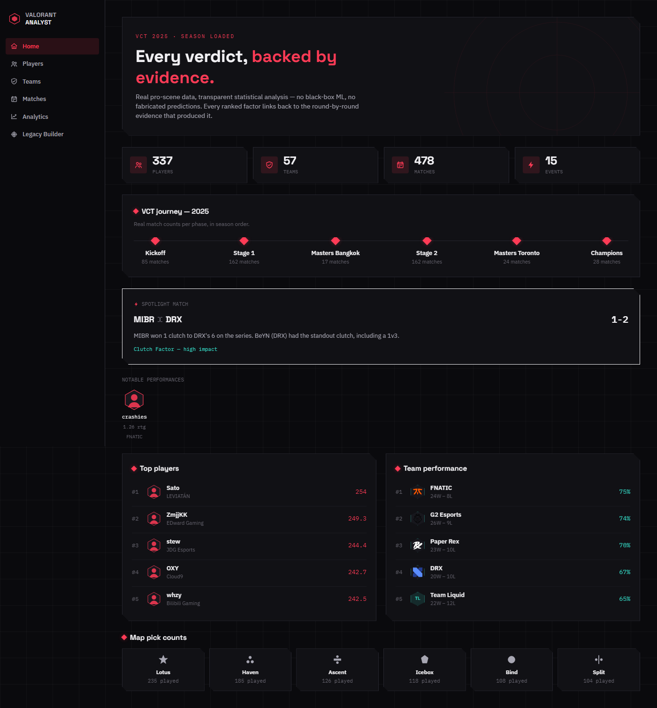
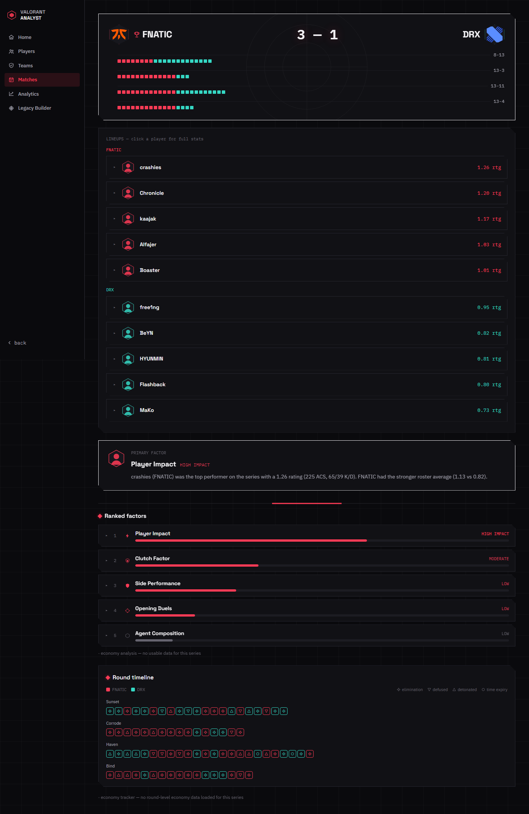
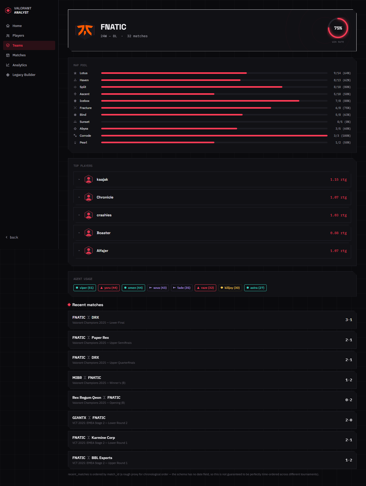
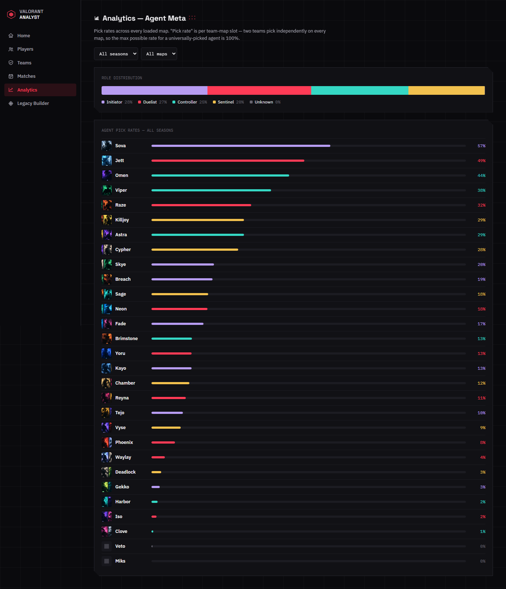

# Valorant Analyst


An open-source VALORANT esports analytics platform built on **real pro-scene
data**, with **transparent, inspectable statistics**. There is no black-box
machine learning and no fabricated predictions. Every number on screen traces
back to a real loaded match, or the feature says so explicitly and shows
nothing rather than guess.

The guiding sequence is **Data, then Analysis, then Explanation, then
Recommendation**.

The platform is loaded with the full 2021 to 2026 VALORANT Champions Tour
history: 12,621 matches, 15,215 players, 4,017 teams, and 249 tournaments. The
source is the [Ryan Luong VCT dataset](https://www.kaggle.com/datasets/ryanluong1/valorant-champion-tour-2021-2023-data)
on Kaggle, which is MIT licensed.

## Screenshots

<table>
<tr>
<td></td>
<td></td>
</tr>
<tr>
<td align="center"><sub>Home dashboard: map art and leaderboards</sub></td>
<td align="center"><sub>Match verdict: ranked, evidence-backed factors</sub></td>
</tr>
<tr>
<td></td>
<td></td>
</tr>
<tr>
<td align="center"><sub>Team profile: record, map pool, roster, agent usage</sub></td>
<td align="center"><sub>Analytics: agent pick rates, filterable by season and map</sub></td>
</tr>
</table>

These screenshots were taken before the 2026 interface revamp and will be
refreshed.

## What it does

### Home
A hero with a radar of all twelve maps, so each spoke is one map's real pick
share. Four headline figures sit on one strip. A looping ticker of the latest
series runs automatically, with a Pause control. A spotlight feature shows the
most impactful recent match, and a season view shows matches per phase as
columns. The map atlas covers every map. The meta view shows the top agents by
pick rate as art tiles. Leaderboards have two tabs, top players and team win
rate, each with a podium for the top three. A section index stays visible
while you scroll.

### Teams
Every loaded team, filterable by professional tier and searchable by name.
Three views share one list: cards, a sortable table, and a scatter of matches
played against win rate. Hovering a card reveals the team's logo behind it.
Any two teams can be compared side by side, with the gap between their win
rates stated in points.

### Team profile
A full-season profile: record, form (the last five results), map pool with
map art, the strongest and weakest maps (only maps played at least five
times count), a roster timeline that steps through each year's lineup, agent
usage, a 5-axis stat profile that can be compared with any other Tier 1 team,
a record against each opponent in the recent matches, and recent matches.

### Players
The top 20 players for a chosen metric (rating, ACS, ADR, KAST%, or HS%)
across every loaded season, shown as a podium and a ranked board. A scatter
plots the metric against rating. Any player can be added to a comparison,
including players outside the top 20, and each comparison shows a 5-axis
radar and the real values side by side.

### Matches
Search by team, filter by season and outcome (sweeps, or close series decided
by one map), and browse as a list or grouped by event. Each card can peek at
its top three ranked factors. Open a match for its verdict.

### Match verdict
The core analysis. Six independent analyzers (opening duels, side
performance, player impact, economy, agent composition, and clutch factor)
each rank themselves by measured impact and combine into one ranked,
evidence-backed verdict. The page also shows:

- an impact chart drawn toward the winning side,
- a map board whose tiles open each map's lineups,
- lineups with a rating duel,
- map lineups showing which agent each player used on each map,
- a round timeline with a race chart of rounds won, method tiles that filter
  the rounds, and a summary per team,
- an economy tracker that plots loadout value, or remaining credits where a
  season has no loadout data (labelled as such),
- a sticky section navigator.

### Analytics
Agent meta for the chosen season and map. A featured-agent spotlight shows
the agent's pick rate and its share of its role's picks. A pick map sizes
every agent by pick rate and colours it by role. Role lanes show each role's
share and its agents, and clicking a role filters the page. A map showcase
scopes the whole page, biggest movers compare against the all-seasons
baseline, and a sortable table lists every agent.

### Legacy Roster Builder
Build two hypothetical five-player lineups from any players in the loaded
data and get a model projection. Each projection is labelled as a projection,
never a factual claim, and states what it cannot measure: lineup synergy, and
the fact that individual ratings blend every loaded season rather than one
year's form. Each lineup also shows how many of the four roles it covers, and
undo is available.

### Interface
A command palette (Ctrl+K) searches teams, matches, and pages from anywhere in
the app. Motion honours the reduced-motion setting throughout, except where a
control is provided to pause it (the Home ticker).

## Keyboard shortcuts

| Key | Where | Action |
|---|---|---|
| Ctrl+K (Cmd+K on Mac) | Everywhere | Open or close the command palette |
| Escape | Palette, search dropdowns | Close the open list |
| `/` | Teams, Matches, Analytics | Focus the search box (not while typing) |
| Up and down arrows | Matches list | Move between match cards |
| Left and right arrows | Team profile roster timeline | Step through roster years |
| Up and down arrows, Enter | Player search dropdowns | Move through results and pick one |
| Ctrl+Z (Cmd+Z on Mac) | Legacy Roster Builder | Undo the last lineup change |

## Stack

| | |
|---|---|
| **Backend** | Python, FastAPI, SQLite, pandas (ETL) |
| **Frontend** | React 19, Vite, Tailwind CSS v4 ([`frontend/web/`](frontend/web)) |
| **Legacy frontend** | Dependency-free single-file HTML, CSS, and JavaScript, kept for reference and no-build use ([`frontend/prototype/`](frontend/prototype)) |

## API

The backend exposes 17 endpoints. The interactive documentation is served at
`/docs` while the API is running.

| Endpoint | Purpose |
|---|---|
| `GET /health` | Liveness check |
| `GET /matches` | Match list, filterable by team, tournament, and year |
| `GET /matches/{match_id}` | Match summary, including every map (game) in the series |
| `GET /matches/{match_id}/verdict` | Series-level ranked verdict |
| `GET /matches/{match_id}/timeline` | Round and economy timelines |
| `GET /games/{game_id}/verdict` | Verdict for a single map |
| `GET /games/{game_id}/lineups` | Each team's players on one map, with the agent each played |
| `GET /teams` | Team list, filterable by name and tier |
| `GET /teams/{team_id}/profile` | Full-season team profile |
| `GET /teams/{team_id}/map-leaders` | Best kills, assists, and rating on one map |
| `GET /teams/{team_id}/radar` | Team stat profile, optionally against a second team |
| `GET /players/leaderboard` | Top players for a metric |
| `GET /players/search` | Player name search |
| `GET /players/radar` | Player stat profile, optionally against a second player |
| `GET /stats/overview` | League-wide counts, season journey, top players, team performance, maps |
| `GET /stats/meta` | Agent pick rates and role distribution, optionally by season and map |
| `GET /roster-builder/simulate` | Legacy Roster Builder projection |

## Project structure

```
valorant-analyst/
├── backend/
│   ├── app/
│   │   ├── analyzers/        Analyzer modules: the analytical core
│   │   ├── database/         Schema
│   │   └── main.py           FastAPI application and endpoints
│   └── data/
│       ├── raw/              Gitignored (see backend/data/README.md)
│       ├── dataset_report.md
│       ├── DATA_QUALITY_FINDINGS.md
│       └── valorant.db       Gitignored, about 180 MB, built locally
├── frontend/
│   ├── web/                  React + Vite + Tailwind app (active interface)
│   └── prototype/            Original no-build prototype (legacy)
├── docs/
│   └── screenshots/
├── scripts/                  Dataset inspection and loader scripts
├── CHANGELOG.md
└── LICENSE
```

## Quickstart

**1. Get the data.** `backend/data/valorant.db` is not in this repository. It
is about 180 MB, and GitHub blocks pushes of files over 100 MB, so it is
gitignored and built locally instead:

```bash
# Download https://www.kaggle.com/datasets/ryanluong1/valorant-champion-tour-2021-2023-data
# and extract it to backend/data/raw/, then:
pip install pandas
for year in vct_2021 vct_2022 vct_2023 vct_2024 vct_2025 vct_2026; do
  python scripts/load_match_analyzer.py backend/data/raw "$year" \
    --out backend/data/valorant.db \
    --schema backend/app/database/match_analyzer_schema.sql
done
```

Run the loader once per year, pointing `--out` at the same file each time.
It accumulates rather than overwrites. To rebuild a single season from
scratch, overwriting whatever is at `--out`, add `--fresh`. The full load
takes a few minutes. The 2021 and 2022 seasons alone contain about 7,200 and
3,800 matches.

Read [`backend/data/DATA_QUALITY_FINDINGS.md`](backend/data/DATA_QUALITY_FINDINGS.md)
before extending the ETL. It documents the real data-quality issues found and
handled while building it.

**2. Run the backend and the frontend.**

```bash
# Backend: FastAPI and SQLite
cd backend
pip install fastapi "uvicorn[standard]" pandas
python -m uvicorn app.main:app --reload
# Serves http://127.0.0.1:8000, with interactive docs at /docs

# Frontend: React and Vite
cd frontend/web
npm install
npm run dev
# Serves http://localhost:5173 and connects to the API above
```

If the API is not running, or the database has not been built, the frontend
falls back to a small set of real, not fabricated, bundled demo data, so it
stays browsable. See [`frontend/web/README.md`](frontend/web/README.md) for
build options and environment variables. The zero-install legacy version is
[`frontend/prototype/index.html`](frontend/prototype/index.html), which you can
open directly in a browser.

## Assets and images

Images live under `frontend/web/public/assets/`:

| Folder | Contents | Used by |
|---|---|---|
| `agents/<agent>.jpg` | Full agent illustration | Analytics, map lineups, verdict and lineup cards |
| `agents/profiles/<agent>.jpg` | Square head-and-shoulders crop | Player profile icons |
| `maps/<map>.jpg` | 16:9 map illustration, 1600 by 900 | Home, team profile, analytics, verdict |
| `valorant/teams/<slug>.<ext>` | Team logo, copied from `frontend/prototype/assets/valorant/teams/` at dev and build time | Team badges and watermarks |
| `ui/` | Decorative background texture | Page background |

Names are lowercase, and map and agent names must match the database exactly.

**Team logos** are tracked in the repository under
`frontend/prototype/assets/valorant/teams/`. Before each dev or build run,
`frontend/web/scripts/sync-team-logos.mjs` copies them into
`frontend/web/public/assets/valorant/teams/`, which is gitignored. The app
finds a logo by a slug derived from the team name (lowercase, with spaces and
punctuation replaced by hyphens). Teams without a matching file show a
generated initials badge.
Some teams use a shorter file name than their full name (for example
`gambit.png` for "Gambit Esports"), so their badge falls back to initials
until an alias is added.

## Design principles

- **Never fabricate a statistic or invent a tactical explanation.** Every
  number traces back to real loaded data, or the feature says so explicitly
  and shows nothing rather than guess.
- **No black-box machine learning for "why did this happen".** Scoring is
  transparent, inspectable, and component-based.
- **Sample size matters.** Small-sample results are flagged, not treated the
  same as well-supported ones.
- **Projected content is always labeled.** The Legacy Roster Builder is never
  presented as a factual prediction.

## Documentation

| Document | Contents |
|---|---|
| [`docs/API.md`](docs/API.md) | Every endpoint: parameters, response fields, and errors |
| [`docs/ARCHITECTURE.md`](docs/ARCHITECTURE.md) | How data moves from the source to the screen, and the design decisions |
| [`docs/DEVELOPMENT.md`](docs/DEVELOPMENT.md) | Setup, checks, how to add a page, endpoint, or analyzer, and troubleshooting |
| [`frontend/web/README.md`](frontend/web/README.md) | The frontend: structure, interface conventions, and assets |
| [`backend/README.md`](backend/README.md) | The backend: configuration and a quick smoke test |
| [`backend/data/DATA_QUALITY_FINDINGS.md`](backend/data/DATA_QUALITY_FINDINGS.md) | Data problems found and handled by the loader |
| [`CHANGELOG.md`](CHANGELOG.md) | Release notes |
| [`CONTRIBUTING.md`](CONTRIBUTING.md) | How to contribute |

## License

MIT. See [`LICENSE`](LICENSE), which matches the source dataset's license, for
the code in this repository.

This project avoids reproducing Riot's own game assets. Player profile icons
show a player's historically best-performing agent as original stylized art,
not a photograph of the player, and fall back to an abstract silhouette when
no agent is known. The agent and map artwork is original AI-generated
illustration in an independent style. It is not real screenshots, in-game
callouts, or Riot character art. The team logos under
`frontend/prototype/assets/valorant/teams/` are the one set of real images in
the repository. Confirm your own rights to them before publishing a fork. See
the Assets section above.

VALORANT is a trademark of Riot Games, Inc. This project is not affiliated
with or endorsed by Riot Games.
