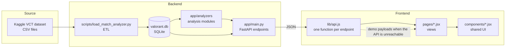

# Architecture

This document explains how Valorant Analyst is put together: how data moves
from the source files to the screen, what each layer is responsible for, and
the decisions that shape the code. Read it before changing anything that
crosses a layer.

## System overview

The system has three layers, and each depends only on the layer below it:

1. **ETL** turns the raw CSV dataset into a relational SQLite database.
2. **Analyzers and the API** read the database, compute statistics, and serve
   JSON.
3. **The frontend** renders that JSON. It never reads the database or the
   CSV files directly.

## Data layer

### Source

The source is the Ryan Luong VCT dataset on Kaggle. It is MIT licensed. The
raw files are kept under `backend/data/raw/`, which is gitignored because the
dataset is about 1.3 GB. `backend/data/README.md` explains how to obtain it.

### ETL

`scripts/load_match_analyzer.py` reads one season's files at a time and loads
them into the database. Run it once per season against the same `--out`
file. It accumulates rows rather than overwriting, unless `--fresh` is passed.
`backend/data/DATA_QUALITY_FINDINGS.md` lists the data-quality problems the
loader handles, and it should be read before the loader is extended.

### Schema

The schema is in `backend/app/database/match_analyzer_schema.sql`. The main
tables are:

| Table | Holds |
|---|---|
| `tournaments`, `stages` | Event and stage names |
| `teams`, `players`, `agents` | Entities, each with a stable ID |
| `matches` | One series: teams, maps won, winner, and match type |
| `games` | One map inside a series, with its round scores |
| `rounds`, `round_team_economy` | Round results and economy per side |
| `player_game_stats` | Per-player statistics for each map |
| `player_game_agents` | The agent or agents each player used on each map |
| `player_game_impact` | Multi-kills, clutches, and plants per player per map |
| `team_game_agent_picks` | Agent picks by each team on each map |
| `match_draft_actions` | Map pick and ban order |

The database is about 180 MB and is gitignored. Build it locally. The path
defaults to `backend/data/valorant.db` and can be changed with the
`VALORANT_DB_PATH` environment variable.

## Analysis layer

`backend/app/analyzers/` holds the statistical logic. Each module is
independent and reads the database through a connection it is given. The
modules are:

| Module | Responsibility |
|---|---|
| `match_verdict.py` | Runs the verdict analyzers and ranks their results |
| `opening_duels.py` | First-kill and first-death patterns |
| `side_performance.py` | Attack and defence strength |
| `player_impact.py` | Player-level impact, the source of the MVP factor |
| `economy_analysis.py` | Economy and buy behaviour |
| `agent_analysis.py` | Agent composition, and each player's best-performing agent |
| `clutch_analysis.py` | Clutch rates |
| `match_timeline.py` | Round and economy timelines |
| `team_profile.py` | Team records, map pools, rosters, and recent matches |
| `radar_stats.py` | Five-axis profiles for teams and players, with shared bounds |
| `overview_stats.py` | Home page figures and the players leaderboard |
| `meta_stats.py` | Agent pick rates and the role split |
| `roster_builder.py` | The Legacy Roster Builder projection |

### How the verdict is produced

`match_verdict.ANALYZERS` lists the six analyzers that contribute to a
verdict. Each returns an `impact` score between 0 and 1, plus its evidence.
The verdict sorts them by impact and labels each one. The impact bands are
`IMPACT_HIGH` at 0.6 and `IMPACT_MODERATE` at 0.3. Adding an analyzer means
adding one entry to that list. Nothing else in the file should need to change.

### Principles

- **Every statistic traces to stored data.** An analyzer that has no usable
  data for a series reports the reason rather than inventing a value. The
  verdict lists these in `skipped_analyzers`.
- **Small samples are flagged.** Where a result rests on few games, the
  response carries a flag (`small_sample` for map leaders, `low_sample` for
  roster players), and the interface shows it.
- **Radar axes share bounds.** A radar profile is scaled to the range of
  loaded teams or players, not to a fixed maximum. The bounds are computed
  once and cached in `_BOUNDS_CACHE` (in `radar_stats.py`), keyed by the
  population and the sample threshold. A value outside the loaded range is
  marked `out_of_range`, not clipped.

## API layer

`backend/app/main.py` defines the endpoints. Each handler opens a connection,
calls one analyzer function, returns the result, and closes the connection in
a `finally` block. The full contract is in [`API.md`](API.md).

### Caching

Heavier endpoints are memoised with `functools.lru_cache`. The cache lives in
the server process, so a rebuilt database needs a server restart. The
cache sizes are chosen per endpoint. Endpoints with a single answer, such as
the league overview, use a size of one.

### Errors

Handlers translate analyzer errors into HTTP responses. An unknown identifier
returns 404. An invalid argument that the handler checks returns 400.
FastAPI's own validation returns 422 for parameters of the wrong type or
range. Every error body has a `detail` field.

### Configuration

| Variable | Default | Purpose |
|---|---|---|
| `VALORANT_DB_PATH` | `backend/data/valorant.db` | Database file to read |

CORS is configured in `main.py`. It currently allows every origin, which is
appropriate only for local development.

## Frontend

### Shell and navigation

The frontend is a single-page React application built with Vite and styled
with Tailwind CSS v4. It does not use a router library. `App.jsx` holds the
current view in state, along with a history stack, so the Back button returns
to the previous view. Opening a team or a match pushes the current view onto
the stack.

`App.jsx` also mounts the command palette, which listens for Ctrl+K anywhere
in the application.

### Data access

`src/lib/api.js` contains one function per endpoint. Pages never call `fetch`
directly. Each function:

1. Calls the endpoint with a timeout appropriate to its cost.
2. Returns the parsed JSON on success.
3. Falls back where a fallback exists, and returns an explicit "not
   available" value where it does not.

Demo fallbacks use real payloads captured from a loaded season, stored in
`src/lib/demo/*.json`. A function never invents data when the API is
unreachable. Some features, such as the Legacy Roster Builder, have no
fallback at all, because their results depend on the full database.

### Pages and components

Each page is one file in `src/pages/`. Shared pieces live in
`src/components/`. `ui.jsx` holds the primitives that every page uses:
`Panel`, `Label`, `SectionHeader`, `Button`, `Select`, `EmptyState`, and
`LoadingState`. The page-specific pieces are described in
[`frontend/web/README.md`](../frontend/web/README.md).

### State conventions

The frontend follows a few rules that keep the pages predictable:

- **Requests are cancelled on change.** An effect that fetches data sets a
  `cancelled` flag in its cleanup, so a slow response for an old selection
  cannot overwrite a newer one.
- **Team-scoped state resets during render.** `TeamProfile` and `TeamBadge`
  store the identity they were last rendered for and reset their state when it
  changes. This is because the component is reused across teams.
- **Search is debounced.** Typing waits 200 to 250 milliseconds before a
  request is sent, so a request is not sent for every keystroke.
- **Continuous input does not use React state.** Pointer tilt and spotlight
  effects write CSS variables or transforms directly to the DOM. Moving the
  mouse never re-renders a page.
- **Motion respects the user's setting.** Entrance animations are CSS classes
  that the global reduced-motion rule disables. The `useCountUp` hook and the
  tilt handlers check `prefers-reduced-motion` themselves.

### Hooks

`src/lib/hooks.js` provides two hooks used across pages:

- `useCountUp(target, duration)` eases a number up to its value. It shows the
  final value at once for users who prefer reduced motion.
- `useSlashToFocus(ref)` moves focus to a search box when "/" is pressed,
  unless the user is already typing.

## Design principles

- **Transparency over sophistication.** Scores are built from components a
  reader can inspect. There is no opaque model behind the verdicts.
- **Explicit absence.** When data is missing, the interface says so. It does
  not fill the gap with an estimate.
- **Labelled projection.** The Legacy Roster Builder is always presented as a
  projection, and it lists what it cannot measure.
- **No reproduction of Riot's assets.** Agent and map art is original.
  Team logos are tracked under `frontend/prototype/assets` and copied into the
  app by a sync script. Check your rights before redistributing them.
